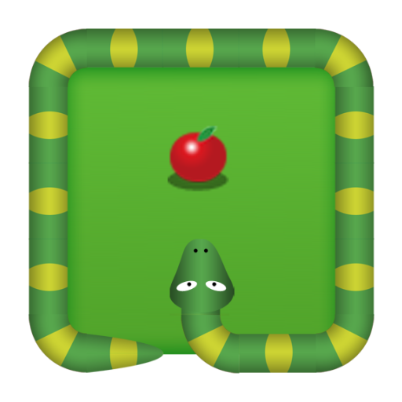

<h1 size="4">Snake Game &copy; v0.2</h1>

----------------

## Game editor
**Julien Gabard**
##### *[Facebook](https://www.facebook.com/julien.gabard.3)*
##### *[Linkedin](https://www.linkedin.com/in/julien-gabard/)*

## Contrôle
Directional arrows.

## Application
The application launches directly on the browser.

## Made with
- **React**
  - *Webpack*
  - *Babel*
  - *React-Feather*
  - *sass*
  - *cssnano*
  - *chai*
  - *enzyme*
  - *jsdom*
  - *ect...*
  > See the file - [package.json](package.json)
- **VScode**
  - *ESlint*
  - *Apache Conf*
  - *DotENV*
  - *Git Graph*
  - *One Dark Pro*
  - *SCSS IntelliSense*
  - *vscode-icons*
- **Linux**
  - *Ubuntu 20.04*

## Version (history)
#### v0.2
> Addition of a play button.
#### v0.1
> functional base set.